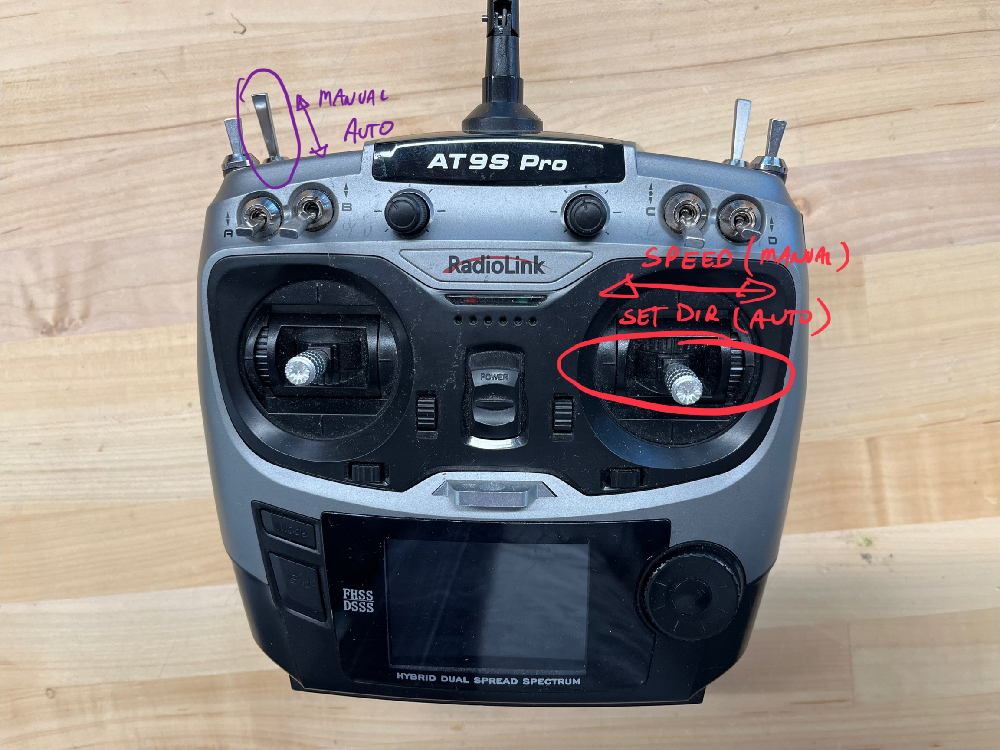

# SAMD21

This is the code that runs on the SAMD21 microcontroller.

## Building

You'll need to comment out the SERCOM5 in your samd variants:

`.../.platformio/packages/framework-arduino-samd-sparkfun/variants/SparkFun_SAMD_Mini/variant.cpp`

(currently lines 217 - 220)

Otherwise, the code should just pull from various github libraries (see .ini file).

## Connecting from ROS

Provides interface with low-level devices: sensors, motors, etc.

ROS interface is provided via a Serial on pins 0 and 1 -- **not** the main USB connector, which is used for sending debugging info.

On a ROS device connected via USB, run

```rosrun rosserial_python serial_node.py /dev/ttyxxxx```

where the port is typically `/dev/ttyACM0` or `/dev/ttyUSB0` -- you may need to list out the ports to find it.

More info about rosserial can be found at http://wiki.ros.org/rosserial_arduino/Tutorials/

## List of SERCOMs

* SERCOM0: Jetson via UART on D0 and D1.
* SERCOM1: Standard SPI on D10-13. Not used. 
* SERCOM2: GPS on D3 and D4 via UART. `See gps-ROS.cpp`.
* SERCOM3: Standard I2C on D20 and D21. So far just battery monitor (except that is moving to the Jetson).
* SERCOM4: TFmini UART on pins A1 and A2 (D15 and D16, I think). See `tfmini-ROS.cpp`.
* SERCOM5: TFmini UART on pins D6 and D7. Note that you have to remove the default SERCOM5 in Arduino to make this work. See `tfmini-ROS.cpp` for deets.

## List of Custom Timers

* TCC0:4 on D2 (PA14) ~~for the ESC. 50Hz.~~ **N.B. PA14 and PA15 are on the same MUX register!** Be careful not to clobber. 
* TC3:1 on D5 (PA15) for the LED. 10Hz. **N.B. PA14 and PA15 are on the same MUX register!** Be careful not to clobber. 
* ~~TCC2 on D11 (PA16) for sound. Variable freq. Set up in LED, since they share a source clock.~~ Sound is now managed from the Jetson.
* TCC1 for encoder timer. Set to 20ms. Raises flag to process encoder count.

## Connections.

See [here](docs/Connections-SAMD21.jpg) for connections. The various files also define the pins.

## Radio Control

Radio control is managed by the SAMD21. There are two modes, determined by the flap switch (upper left):
* _Manual override_ ("override" in the code) allows the user to drive the robot with the right joystick
* _Auto control_ will allow the robot to patrol the wire. When it gets close to an object, the robot will slow down, start flashing lights, and make a sound. [State diagram is found here](docs/Auto-Patrol-State-Diagram.jpg). Currently, the robot will make three attempts and then turn around. Alternatively, the user can command the robot to change patrol direction with the right joystick (it won't control speed, just command the direction).

See [radio-ROS.cpp](src/radio-ROS.cpp) for pin connections. Power is provided _from_ the protoboard to the radio receiver. The servo pulses from the radio are interpreted by the SAMD21 using one of the timers for measuring the pulse width (using interrupts, not the event system built into the SAMD21).

There is a [whole pile of counters and such](docs/RC-Mode-State-Diagram.jpg) to reduce glitches.

The radio controller uses the controls indicated below. Always start with the toggle in manual. Use the speed control to prove communication. To go to auto, toggle the switch, but note that the robot is in an idle state for safety. Briefly hold the speed stick to one side or the other to indicate a direction to patrol (you can release it after a second or so). Change directions by moving the stick to the other side for a short period of time. Moving the toggle puts it back in manual mode.
